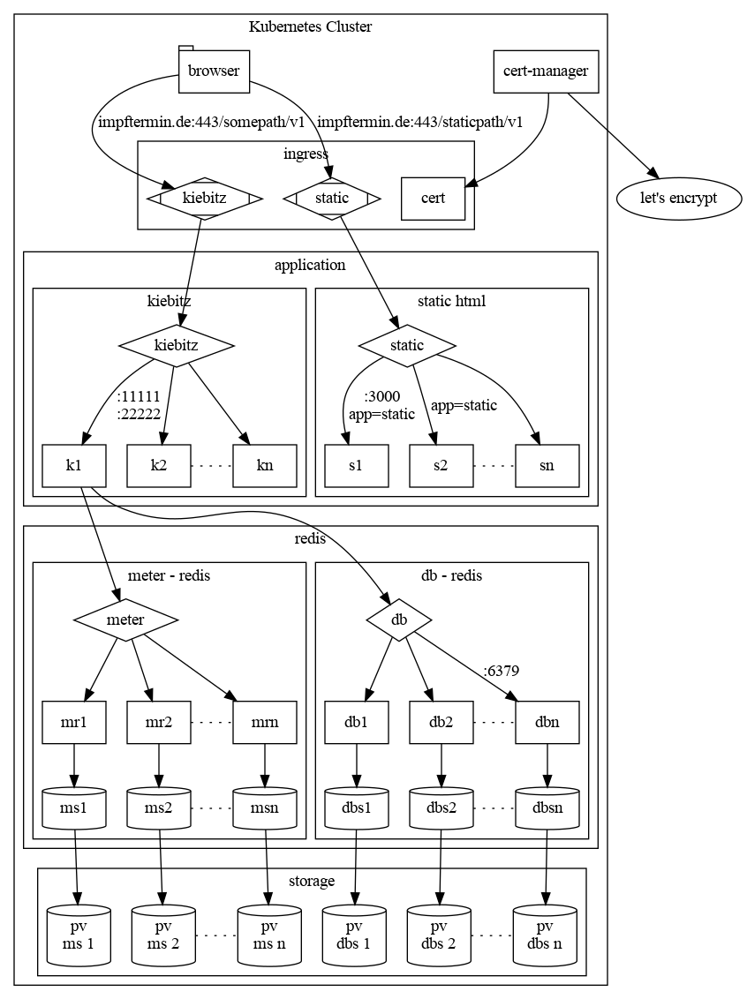

# Overview on the architecture




The diagram has been created by

```bash

dot -Tpng connections.dot -o connections.png

```

Please change the diagram in [connections.dot](connections.dot) and checkin both the `.dot` and the `.png` file